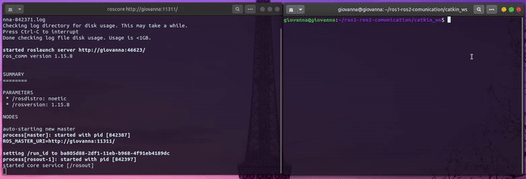
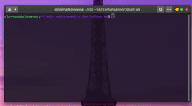
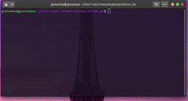
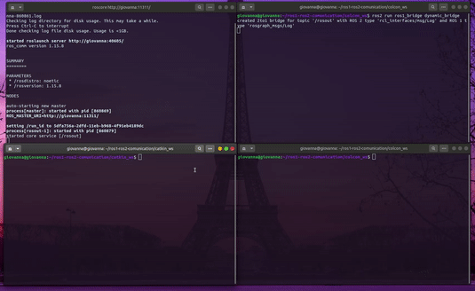
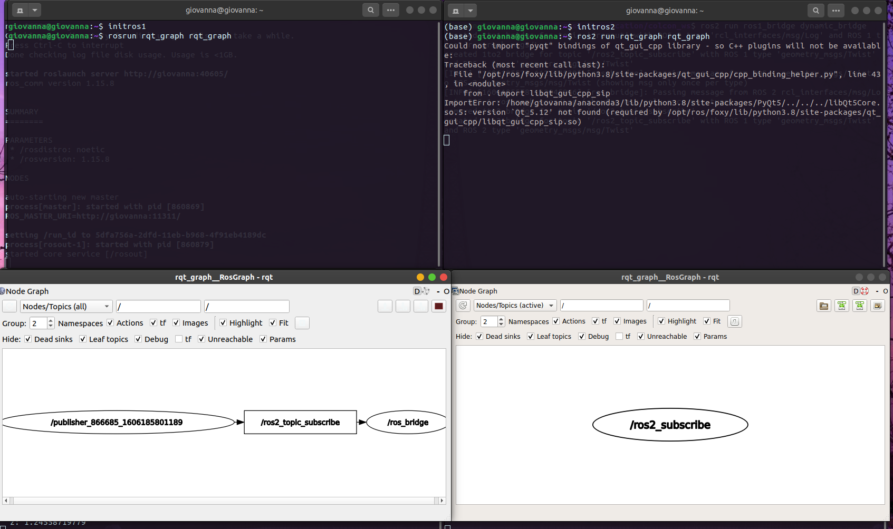

# ROS1 e ROS2 (Comunicação entre nodes)

Projeto de implementação de nós em ROS1 e ROS2, utilizando uma bridge para a integração dos nós e comunicação via tópico.

## Sumário

* [Mão na massa](#handson)
    * [Pré-requisitos](#requirements)
    * [Implementação de um nó em ROS1](#ros1_node)
    * [Implementação de um nó em ROS2](#ros2_node)
    * [Estabelecendo a comunicação dos nós - bridge](#bridge)
    * [Analisando o grafo de comunicação com RQT GRAPH](#graph)

<a id="handson"></a>
## Mão na massa:

<a id="requirements"></a>
### Pré-Requisitos:
Para o projeto foram utilizados as seguintes versões de ROS1 e ROS2, considerando o sistema operacional utilizado que foi o Ubuntu 20.04:
* [ROS - Noetic](http://wiki.ros.org/noetic/Installation/Ubuntu)
* [ROS - Foxy]()

<a id="ros1_node"></a>
### Implementação de um nó em ROS1:
Para a implementação de um nó em ROS1, foram feitos os seguintes passos:
<b>Criação do espaço de trabalho:</b>
```bash 
    $ mkdir -p catkin_ws/src
    $ cd catkin_ws/src/
    $ catkin_init_workspace
    $ cd catkin_ws
    $ catkin_make
 ```
 <b>Criação do pacote:</b>
 ```bash 
    $ cd catkin_ws/src/
    $ catkin_create_pkg ros1_publisher rospy geometry_msgs
 ```
 <b>Criação do script python para a construção do nó:</b>
 ```bash 
    $ cd ros1_publisher/src/
    $ gedit publisher.py
 ```
 <b>Dando permissionamento para o arquivo:</b>
```bash 
    $ chmod +x publisher.py
 ```
<b>Compilando o nó:</b>
```bash 
    $ cd catkin_ws
    $ catkin_make
 ```
<b>Referenciando o caminho:</b>
```bash 
    $ source devel/setup.bash
 ```
 <b>Inicializando o mestre:</b>
```bash 
    $ roscore
 ```
 <b>Executando o nó:</b>
```bash 
    $ rosrun ros1_publisher publisher.py
 ```
<p align="center">

</p>

<a id="ros2_node"></a>
### Implementação de um nó em ROS2:
Para a implementação dos ROS2, foram realizados os seguintes passos:

<b>Criação do espaço de trabalho:</b>
```bash 
    $ mkdir -p colcon_ws/src
    $ cd colcon_ws
    $ colcon build --symlink-install
 ```
 <b>Criação do pacote:</b>
 ```bash 
    $ cd colcon_ws/src
    $ ros2 pkg create --build-type ament_python --node-name ros2_node_subscribe ros2_subscribe 
    $ cd colcon_ws
    $ colcon build --packages-select ros2_subscribe
 ```
 <b>Modificando o arquivo ros2_node_subscriber.py para implementação do nó:</b>
 ```bash 
    $ cd colcon_ws/src/ros2_subscribe/ros2_subscribe/
    $ gedit ros2_node_subscribe.py
 ```
<b>Compilando o nó:</b>
 ```bash 
    $ cd colcon_ws
    $ colcon build
 ```

<b>Referenciando o caminho:</b>
 ```bash 
    $ . install/local_setup.bash
 ```

 <b>Executando o nó:</b>
 ```bash 
    $ ros2 run ros2_subscribe ros2_node_subscribe 
 ```
<p align="center">

</p>

<a id="bridge"></a>
### Estabelecendo a comunicação dos nós - bridge:
Para que a comunicação entre o publisher escrito em ROS1 consiga enxergar o subscriber em ROS2, foi necessário a implementação de uma bridge(ponte) do ROS1 para o ROS2:

```bash 
    $ sudo apt install ros-foxy-ros1-bridge #instalando aa bridge do ROS2 para o ROS1
    $ cd colcon_ws #entrando no diretório do nó em ROS2
    $ colcon build --symlink-install --packages-skip ros1_bridge #compilando o pacote para a implementação da bridge de comunicação com ROS1

    #startando a ponte
    $ export ROS_MASTER_URI=http://localhost:11311 
    $ ros2 run ros1_bridge dynamic_bridge
 
 ```
 <p align="center">

</p>

Com isso, o nó em ROS1 consegue escrever no tópico em que o nó em ROS2 escuta:

<p align="center">

</p>

<a id="graph"></a>
### Analisando o grafo de comunicação com RQT GRAPH:

Para o entendimento do grafo de comunicação entre os nós, foi utilizado o RQT GRAPH:

<p align="center">

</p>


